# Air Agentic — Agent-Ready Analytics with WebMCP


A demo flight booking app that shows how to instrument a web application for **both human and AI agent interactions** using a single, coherent analytics data model.

The core idea: as AI agents begin completing e-commerce flows autonomously (searching, selecting, and purchasing on behalf of users), your analytics stack needs to capture both types of interaction — in the same events, with the same funnels — so you can compare and understand agent-driven behaviour alongside human behaviour.

---

## What this demo shows

**Air Agentic** is a fictional airline that exposes a native [WebMCP](https://github.com/webmachinelearning/webmcp) interface alongside its standard UI. Any AI agent with WebMCP support can search flights, add them to a booking, select seats, and complete checkout — without scraping, browser automation, or custom integrations.

Every action, whether triggered by a user click or an agent tool call, emits GA4-compatible dataLayer events with a single custom dimension (`interaction_source`) that tells you who did it.

This means a single GTM + GA4 setup gives you:

- Standard e-commerce funnel reports that include agent-driven transactions
- The ability to segment **any** metric by `interaction_source: "ui"` vs `"agent"`
- Conversion rate, average order value, and drop-off comparisons between humans and AI agents

---

## How the tracking works

```mermaid
flowchart LR
    subgraph USER["👤 User"]
        U_CLICK["Clicks UI\n(search, select,\npay…)"]
    end

    subgraph AGENT["🤖 AI Agent"]
        A_TOOL["Calls WebMCP tool\n(search_flights,\nadd_to_booking…)"]
    end

    subgraph APP["Air Agentic App (browser)"]
        HANDLER["Event handler\n/ tool execute()"]
        DL["window.dataLayer.push()\n{ event, ecommerce,\ninteraction_source }"]
    end

    subgraph GTM["Google Tag Manager"]
        TRIGGER["Trigger\n(Custom Event)"]
        TAG["GA4 Event Tag\n+ Ecommerce"]
    end

    subgraph GA4["Google Analytics 4"]
        REPORT["Reports &\nExplorations"]
        DIM["Custom dimension:\ninteraction_source\n= ui | agent"]
    end

    U_CLICK -->|"interaction_source: ui"| HANDLER
    A_TOOL -->|"interaction_source: agent"| HANDLER
    HANDLER --> DL
    DL --> TRIGGER
    TRIGGER --> TAG
    TAG --> REPORT
    DIM -.->|"segment any metric"| REPORT
```



Both paths flow through the same dataLayer push — the only difference is the value of `interaction_source`. GTM and GA4 never need to know about WebMCP; the standard event contract handles everything.

---

## Getting started

```bash
pnpm install
pnpm dev
```

### Google Analytics 4

Add your GA4 Measurement ID to `.env`:

```
GA4_ID=G-XXXXXXXXXX
```

The standard gtag.js snippet is injected server-side automatically. If `GA4_ID` is not set the app runs without analytics — no errors, events are simply not sent.

### Build for production

```bash
pnpm build
```

---

## Data model

### The one custom dimension

Configure this once in GA4 and GTM, then every event in the table below becomes segmentable by source:

| Setting | Value |
|---|---|
| Name | Interaction Source |
| Parameter name | `interaction_source` |
| Scope | Event |
| Type | String |
| Values | `"ui"` · `"agent"` |

### Event reference

All ecommerce events follow the [GA4 Enhanced Ecommerce](https://developers.google.com/analytics/devguides/collection/ga4/ecommerce) schema. Every `ecommerce` push is preceded by `{ ecommerce: null }` to prevent data bleed between events.

#### Standard ecommerce events

| Event | UI trigger | Agent trigger |
|---|---|---|
| `view_item_list` | Search results render | — |
| `select_item` | User clicks "Select" on a fare class | — |
| `search` | Search form submitted | `search_flights` tool called |
| `add_to_cart` | Seat confirmed in seat map | `add_to_booking` tool called |
| `remove_from_cart` | Item removed from booking sidebar | — |
| `view_cart` | — | `get_booking` tool called |
| `begin_checkout` | "Complete Booking" button clicked | `checkout` tool called |
| `purchase` | "Pay" button clicked | `checkout` tool with all fields auto-submits |
| `seat_selected` | Seat picked in seat map | `select_seat` tool called |

`seat_selected` is a custom event (not a GA4 standard) but follows the same naming convention and carries `interaction_source`.

#### Item schema

All items in ecommerce events share a consistent structure:

```json
{
  "item_id": "AA101-BIZ",
  "item_name": "JFK → LAX · Business",
  "item_brand": "Air Agentic",
  "item_category": "Business",
  "price": 799,
  "quantity": 1,
  "item_variant": "3A"
}
```

`item_variant` is set on `purchase` events only, carrying the selected seat label.

#### `seat_selected` payload

```json
{
  "event": "seat_selected",
  "seat_label": "3A",
  "seat_type": "window",
  "class_id": "AA101-BIZ",
  "flight_id": "AA101",
  "preference": "window",
  "interaction_source": "agent"
}
```

`preference` is populated only on agent-triggered events (it's the preference passed to the `select_seat` tool).

#### `search` payload

```json
{
  "event": "search",
  "search_term": "JFK → LAX",
  "from": "JFK",
  "to": "LAX",
  "results_count": 2,
  "interaction_source": "ui"
}
```

#### `purchase` payload

```json
{
  "event": "purchase",
  "ecommerce": {
    "transaction_id": "AA-1740000000000",
    "currency": "USD",
    "value": 799,
    "items": [{ "item_id": "AA101-BIZ", "item_name": "JFK → LAX · Business", "item_brand": "Air Agentic", "item_category": "Business", "price": 799, "quantity": 1, "item_variant": "3A" }]
  },
  "interaction_source": "agent"
}
```

> **PII policy** — no personally identifiable information (name, email, card details) is ever sent to the dataLayer. All such data stays in local component state only.

### Human vs agent funnel

```
UI funnel:
  search → view_item_list → select_item → seat_selected → add_to_cart → begin_checkout → purchase

Agent funnel:
  search → add_to_cart (or select_seat → add_to_cart) → view_cart → begin_checkout → purchase
```

The agent funnel is shorter and skips browsing steps (`view_item_list`, `select_item`) because agents go directly to intent. Comparing funnel length and conversion rates between the two sources is one of the primary insights this setup enables.

---

## Architecture

| Layer | Technology |
|---|---|
| Framework | [TanStack Start](https://tanstack.com/start) (React, SSR) |
| Routing | TanStack Router (file-based) |
| State | Zustand |
| Styling | Tailwind CSS v4 |
| Agent interface | [WebMCP](https://github.com/mcp-b/global) (`navigator.modelContext`) |
| Analytics | GTM + GA4 via `window.dataLayer` |

### WebMCP tools

The app registers five MCP tools on `navigator.modelContext` that any WebMCP-compatible AI agent can discover and call:

| Tool | Description |
|---|---|
| `search_flights` | Search available flights by origin/destination |
| `add_to_booking` | Add a flight class to the current booking |
| `get_booking` | Read the current booking summary and total |
| `select_seat` | Pick a specific seat or auto-select by preference |
| `checkout` | Open and optionally auto-complete the checkout form |

### Analytics implementation

`src/lib/analytics.ts` exports two functions used throughout the app:

- **`pushDataLayerEvent(name, payload)`** — for non-ecommerce events (`search`, `seat_selected`)
- **`pushEcommerceEvent(name, ecommerce, extra)`** — clears `ecommerce: null` first, then pushes the event; used for all ecommerce events

GTM is initialised in `src/routes/__root.tsx` via the server-rendered shell component, ensuring the snippet is in place before any client-side code runs.

---

## GA4 setup guide

1. **Add your Measurement ID** to `.env`: `GA4_ID=G-XXXXXXXXXX`

2. **Register the custom dimension** in GA4:
   - Admin → Custom definitions → Custom dimensions → Create
   - Name: `Interaction Source` · Parameter name: `interaction_source` · Scope: Event

3. **Enable Enhanced Ecommerce** — GA4 supports it natively; no extra configuration needed. Events like `add_to_cart`, `begin_checkout`, and `purchase` are recognised automatically.

4. **Verify** with GA4 DebugView — filter by `interaction_source` to confirm both `"ui"` and `"agent"` values appear.
